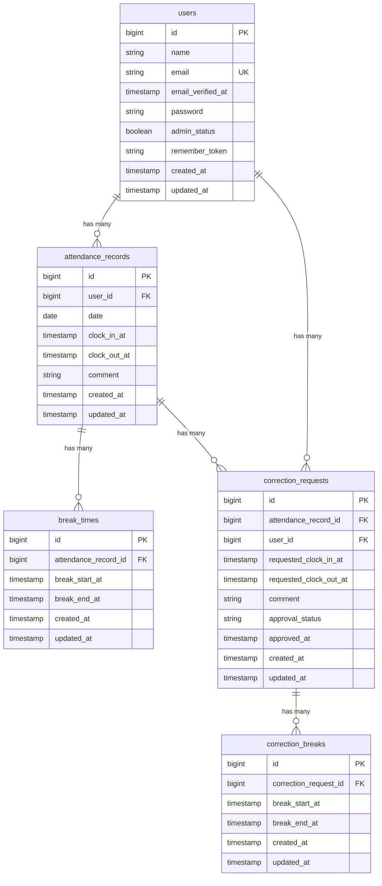

# coachtech 勤怠管理アプリ
## 概要
本アプリケーションは、一般ユーザーと管理者が勤怠情報を管理できる勤怠管理システムです。

一般ユーザーは、出勤・休憩・退勤の打刻や、月ごとの勤怠情報の確認、勤怠内容の修正申請を行うことができます。また、過去6ヶ月の勤怠データを表示するマイ勤怠レポート機能を実装しています。
管理者は、ユーザーの勤怠情報を確認・編集できるほか、一般ユーザーから申請された勤怠内容の修正申請を確認・承認することができます。

また、勤怠情報をAPIから取得・登録・更新・削除できるよう、Laravel Sanctumを利用したAPI（v1）も実装しています。

## 作成者
浅井 明日香

## 使用技術
### バックエンド
- PHP 8.5
- Laravel 10.4
- Laravel Fortify（認証機能）
- Laravel Sanctum（APIトークン認証）
- MySQL 8.4

### フロントエンド
- Tailwind CSS 3.4
- Vite
- Alpine.js

### 開発ツール
- Docker / Docker Compose / Laravel Sail
- phpMyAdmin
- Nginx
- PHPUnit（テスト）
- Postman（API動作確認）
- Git/GitHub（バージョン管理）

## ER図


### 機能一覧
#### 一般ユーザー
* ユーザー登録・ログイン・ログアウト
* 出勤・退勤の打刻
* 休憩開始・休憩終了の打刻
* 月ごとの勤怠一覧の確認
* 勤怠詳細の確認
* 勤怠内容の修正申請
* 修正申請の承認状況の確認
* 過去6ヶ月の勤怠レポート表示

#### 管理者
* 管理者ログイン・ログアウト
* スタッフ一覧表示
* ユーザーの勤怠一覧・詳細の確認
* 勤怠情報の修正
* 一般ユーザーからの修正申請の確認
* 修正申請の承認

#### API
* ログイン・認証
* 勤怠一覧の取得
* 勤怠詳細の取得
* 勤怠の登録
* 勤怠の更新
* 勤怠の削除

## URL
- 開発環境：http://localhost
- phpMyAdmin：http://localhost:8080/

## 動作環境
- Docker
- Docker Compose

※ Windowsの場合はWSL2の利用を推奨します。

## 環境構築手順
1. リポジトリを取得  
任意のディレクトリでリポジトリをクローンします。
```
git clone https://github.com/Asuka-Asai06/attendance-app.git attendance-app
```

2. プロジェクトディレクトリに移動
```
cd attendance-app
```

3. Composer依存パッケージをインストール
```
docker run --rm \
    -u "$(id -u):$(id -g)" \
    -v "$(pwd):/var/www/html" \
    -w /var/www/html \
    -e COMPOSER_CACHE_DIR=/tmp/composer_cache \
    laravelsail/php82-composer:latest \
    composer install --ignore-platform-reqs
```

4. 環境設定ファイルをコピー  
.env.example をコピーして .env を作成します。
```
cp .env.example .env
```
.env ファイル内の以下のDB接続情報を確認・設定します。.env.example のデフォルト値はSail向けではないため、以下のように変更してください。
```
DB_CONNECTION=mysql
DB_HOST=mysql
DB_PORT=3306
DB_DATABASE=laravel
DB_USERNAME=sail
DB_PASSWORD=password
```

5. Laravel Sailを起動  
以下のコマンドでDockerコンテナを起動します。
```
./vendor/bin/sail up -d
```
エイリアスの設定（推奨）  
毎回 ./vendor/bin/sail と入力するのは手間なので、エイリアスを設定すると便利です。
```
alias sail='[ -f sail ] && bash sail || bash vendor/bin/sail'
```

6. アプリケーションキーの生成
```
./vendor/bin/sail artisan key:generate
```

7. データベースのマイグレーションと初期データ投入  
以下のコマンドでテーブルを作成し、ダミーデータを投入します。  
```
sail artisan migrate:fresh --seed
```

このコマンドの入力後、下記のエラーが表示されることがあります。
```
   Illuminate\Database\QueryException 
  SQLSTATE[HY000] [1044] Access denied for user 'sail'@'%' to database 'attendance-app' (Connection: mysql, SQL: select table_name as `name`,         (data_length + index_length) as `size`, table_comment as `comment`, engine as `engine`, table_collation as `collation` from information_schema.tables where table_schema = 'attendance-app' and table_type in ('BASE TABLE', 'SYSTEM VERSIONED') order by table_name)

  at vendor/laravel/framework/src/Illuminate/Database/Connection.php:829
    825▕                     $this->getName(), $query, $this->prepareBindings($bindings), $e
    826▕                 );
    827▕             }
    828▕ 
  ➜ 829▕             throw new QueryException(
    830▕                 $this->getName(), $query, $this->prepareBindings($bindings), $e
    831▕             );
    832▕         }
    833▕     }

  +43 vendor frames 

  44  artisan:35
      Illuminate\Foundation\Console\Kernel::handle()
```
このエラーはコンテナ内にデータが残っており、エラーが生じているケースなどがあります。 その場合は、以下のコマンドを順に実行して各コンテナを再起動して下さい。
```
sail down -v
sail up -d //コマンド実行後にSQLコンテナが立ち上がるまで時間がかかります。30秒ほどお待ちください。
sail artisan migrate:fresh --seed
```

8. NPM依存パッケージのインストール
```
sail npm install
sail npm install alpinejs
sail npm run dev
```
`npm run dev` は開発中は起動したままにしてください。

9. アプリケーションへのアクセス  
一般ユーザーは、以下のURLにアクセスしてください。  
`http://localhost/login`

以下のテスト用アカウントでログインできます。

| 項目      | 内容                 |
| ------- | ------------------ |
| メールアドレス | `user1@example.com` |
| パスワード   | `password`         |  

または
| 項目      | 内容                 |
| ------- | ------------------ |
| メールアドレス | `user2@example.com` |
| パスワード   | `password`         |


管理者ユーザーは、以下のURLにアクセスしてください。  
`http://localhost/admin/login`  
以下のテスト用アカウントでログインできます。

| 項目      | 内容                  |
| ------- | ------------------- |
| メールアドレス | `user3@example.com` |
| パスワード   | `password`          |

※一般ユーザー用のログイン画面から管理者ユーザーとしてログインすることはできません。  

## テスト実行
```
sail artisan test
```
カバレッジ付きで実行する場合:
```
sail artisan test --coverage
```

## APIエンドポイント一覧
勤怠関連のエンドポイントは `/api/v1` プレフィックス配下に定義されています。  
| Method | Endpoint | Description | Authentication |
| ------ | -------- | ----------- | -------------- |
| POST | `/api/login` | ログイン・APIトークン発行 | 不要 |
| GET | `/api/v1/attendance-records` | 勤怠一覧取得 | 不要 |
| GET | `/api/v1/attendance-records/{attendanceRecord}` | 勤怠詳細取得 | 不要 |
| POST | `/api/v1/attendance-records` | 勤怠新規登録 | **Sanctum** |
| PUT | `/api/v1/attendance-records/{attendanceRecord}` | 勤怠更新 | **Sanctum**、認可必須 |
| DELETE | `/api/v1/attendance-records/{attendanceRecord}` | 勤怠削除 | **Sanctum**、認可必須 |

### Authentication
本APIでは、書き込み系エンドポイントの認証にLaravel Sanctumを使用しています。

1. APIトークンを取得する。
ログインAPIにメールアドレスとパスワードを送信します。
```http
POST /api/login
Content-Type: application/json
```
リクエスト例：
```
{
  "email": "user1@example.com",
  "password": "password"
}
```
認証に成功すると、APIトークンが返されます。  
```
{
  "token": "..."
}
```
2. APIトークンを使用する。
取得したトークンを Authorization ヘッダーに指定します。  
```
Authorization: Bearer {token}
```
POST、PUT、DELETEのリクエストでは、このヘッダーが必要です。  
GETエンドポイントは認証不要で利用できます。

